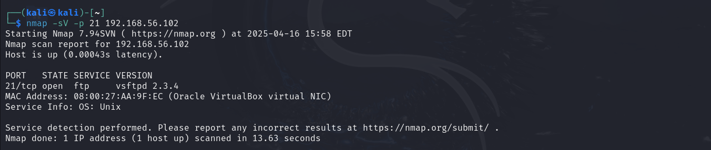
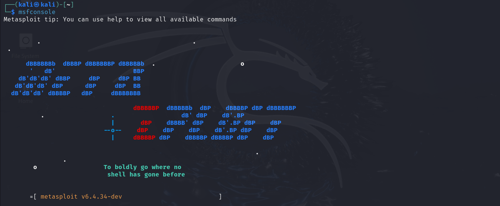
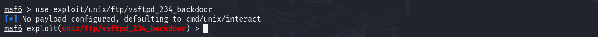
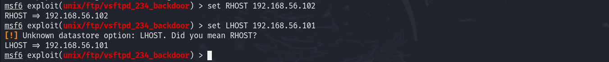
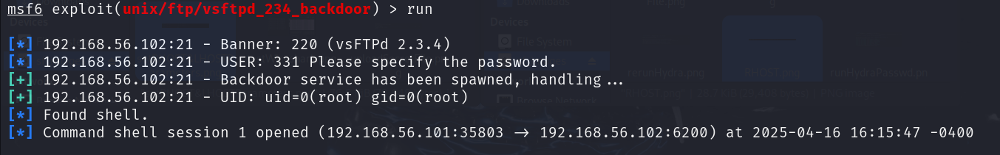

# 🔐 Exploiting vsftpd 2.3.4 Backdoor Vulnerability (CVE-2011-2523)

## 🧾 Project Overview

This project demonstrates how I identified and exploited a known vulnerability in the FTP service `vsftpd 2.3.4` running on Metasploitable 2. The vulnerability provides a backdoor shell, allowing root access. This was done in a safe, virtualized lab environment using Kali Linux as the attacking machine and Metaspoitable 2 as the target machine.

---

## 🛠️ Tools & Technologies Used

- **Kali Linux** (Attacker VM).

- **Metasploitable 2** (Victim VM).

- **Oracle VirtualBox**.

- **Nmap**.

- **Metasploit Framework**

---

## 🎯 Objectives

- Set up a small enterprise-like network.

- Perform vulnerability scanning using industry tools.

- Analyze scan reports.

- Exploit vulnerabilities identified from the scan reports.

- Recommend mitigation strategies.

---

## 📖 Steps Taken

1. Set up a virtual Lab (Environment Prep).

2. Configure the Network Setup.

3. Scan the Target with Nmap.

4. Analyze Open Ports and Identify Vulnerabilities.

5. Exploiting vsftpd 2.3.4 Backdoor Vulnerability (CVE-2011-2523).

6. Validating Access and System Information in the Exploited System.

7. Privilege Escalation.

8. Reporting and Documentation.

---

### Step 1: 🧪 Virtual Lab Setup (Environment Preparation)

💻 Lab Configuration Overview

| Component       | Configuration                     |
|----------------|-----------------------------------|
| Host OS         | Windows 10                                                |
| Attacker        | Kali Linux (VirtualBox VM)                                |
| Target          | Metasploitable 2 (VirtualBox VM)                          |
| Network Type    | Host-Only Adapter (VirtualBox Host-Only Ethernet Adapter) |
| Attacker IP     | `192.168.56.101`                                          |
| Target IP       | `192.168.56.102`                                          |      

This configuration ensures that both virtual machines are on the same isolated network segment, enabling seamless communication between the attacker (Kali Linux) and the target (Metasploitable 2) while keeping the setup secure from external threats.

---

### Step 2: 💡 Configure the Network

To ensure secure and isolated communication between the attacker and target machines, the network was configured using VirtualBox's "Internal Network" mode. This setup allows both virtual machines to interact with each other without any external internet access — an ideal environment for penetration testing.

🔧 Configuration Details:

Network Mode: Internal Network (intnet)

Attacker Machine (Kali Linux): 192.168.56.101 (Static IP)

Target Machine (Metasploitable 2): 192.168.56.102 (Static IP)

🔎 Verifying Connectivity:

Once both virtual machines were configured and running, connectivity was verified using the ping command from each terminal:

From Kali Linux:

- ping 192.168.56.102

From Metasploitable 2:

- ping 192.168.56.101

✅ Outcome:

The successful response from both machines as shown in the screenshot below, confirmed that the virtual environment was properly isolated and communication between the VMs was working as expected. This verification step is critical before beginning any enumeration or exploitation processes.

---

### Step 3: 🔍 Scan the target with nmap

After configuring the network, and performed the ping test to confirming connectivity, I scanned the target Metaspoiltable 2 (192.168.56.102) from Kali to gather intelligence on:

-Open ports.

-Services running.

-Operating system detection.

-Possible vulnerabilities.

---

#### 3.1: 🔍 Initial Scan with nmap
   
To begin the reconnaissance phase, I performed a simple ping scan using Nmap from the attacker machine (Kali Linux). This step was essential to determine whether the target host was active and reachable on the network. The following command was used:

- nmap -sn 192.168.56.102

This command initiates a ping scan (-sn), which sends ICMP echo requests to check the availability of the host without performing a full port scan.

Purpose:

- Verify if the target machine (192.168.56.102) is up and responding.

- Lay the groundwork for more detailed scanning and enumeration.

The screenshot below shows scan result:

- The output confirmed that the host was up and reachable, allowing further enumeration steps to proceed.

---

#### 3.2: 🔍 Full Port Scan

After confirming that the target machine was active, I proceeded with a comprehensive TCP port scan to identify all open ports and potential entry points on the Metasploitable 2 VM (192.168.56.102). The following command was used:

- nmap -p- 192.168.56.102

The -p- flag instructs Nmap to scan all 65,535 TCP ports, rather than the default top 1,000. This ensures that no open ports are missed, which is especially important when hunting for less obvious or non-standard services that might be vulnerable.

Purpose:

- Identify all open TCP ports on the target system.

- Detect potential services or applications that may be running on non-standard ports.

- Lay the groundwork for version detection and vulnerability assessment in subsequent steps.

Scan Result:

- From the result in the screenshots above, we can see the nmap scan report which confirms that the scan is working properly, and also which    ports are open and reachable. With this report, I now know which services to target.

- The scan revealed several open ports, including port 21 (FTP), which is known to run the vulnerable vsftpd 2.3.4 service on Metasploitable 2.

---

### Step 4: 🔍 Analyze Open Ports and Identify Vulnerabilities

To identify open ports and the corresponding services and versions running on the target machine (Metaspoitable 2: 192.168.56.102), the following nmap command was executed on Kali machine (attacker/scanner):

- nmap -sV 192.168.56.102

-sV: Enables version detection to determine what service/version is running on each open port.

The scan results:

#### 📝 Open Ports and Service Analysis:

- **21/tcp (FTP) – vsftpd 2.3.4**  
  A vulnerable version known to have a backdoor that allows unauthenticated remote command execution (CVE-2011-2523).

- **22/tcp (SSH) – OpenSSH 4.7p1**  
  Outdated service. Could be brute-forced or vulnerable to older exploits depending on configuration.

- **23/tcp (Telnet) – Linux telnetd**  
  Telnet transmits data in plain text and is deprecated. Ideal for credential sniffing if in use.

- **25/tcp (SMTP) – Postfix smtpd**  
  May allow user enumeration or be leveraged in spoofing/phishing if misconfigured.

- **53/tcp (DNS) – ISC BIND 9.4.2**  
  Known for multiple vulnerabilities like cache poisoning and remote DoS in older versions.

- **80/tcp (HTTP) – Apache httpd 2.2.8**  
  Outdated web server, may expose known vulnerabilities like directory traversal or RCE.

- **111/tcp (RPCBind) – RPC 2**  
  Can reveal other RPC services like NFS. Often used for reconnaissance and privilege escalation.

- **139 & 445/tcp (SMB) – Samba smbd 3.X - 4.X**  
  May allow file share enumeration, credential exposure, and exploit paths like EternalBlue.

- **512/tcp – rexecd (RSH)**  
  Legacy remote shell, insecure and susceptible to unauthenticated access.

- **513/tcp – rlogind**  
  Deprecated remote login protocol. Likely to allow access without strong auth.

- **514/tcp – rshd**  
  Part of insecure R-services. Can be exploited for remote shell access with minimal effort.

- **1099/tcp (Java RMI) – GNU Classpath grmiregistry**  
  Susceptible to RCE if improperly secured or misconfigured.

- **1524/tcp – Metasploitable bindshell (root shell)**  
  Known intentional backdoor on Metasploitable 2. Connects directly to a root shell.

- **2049/tcp (NFS) – v2-4**  
  If improperly configured, allows unauthenticated mounting of network file shares.

- **2121/tcp (FTP) – ProFTPD 1.3.1**  
  Known vulnerabilities in some configurations, including remote command execution.

- **3306/tcp (MySQL) – MySQL 5.0.51a**  
  An outdated database server. Brute-force and privilege escalation possible.

- **5432/tcp (PostgreSQL) – PostgreSQL 8.3.x**  
  May allow data extraction or privilege escalation if credentials are weak.

- **5900/tcp (VNC) – VNC (protocol 3.3)**  
  If VNC authentication is weak or missing, attacker can gain GUI access.

- **6000/tcp (X11) – Access denied**  
  Indicates X11 is running. If access isn’t restricted, attacker can sniff graphical input/output.

- **6667/tcp (IRC) – UnrealIRCd**  
  Known to have a backdoor (CVE-2010-2075) in some versions allowing unauthenticated command execution.

- **8009/tcp (AJP13) – Apache JServ Protocol**  
  If exposed or misconfigured, it can be exploited via Ghostcat (CVE-2020-1938) to access internal files or execute code.

- **8180/tcp (HTTP Alt) – Apache Tomcat/Coyote JSP 1.1**  
  Often runs Tomcat Manager interface. Vulnerable to default credentials and war file deployment for RCE.

---

#### 🖥️ Target Host Information:

- Operating System: Linux (Oracle VirtualBox VM)

- MAC Address: 08:00:27:AA:9F:EC

- Hostnames Detected: metasploitable.localdomain, irc.Metasploitable.LAN

- OS & Service Fingerprints: Unix/Linux-based services, CPE: cpe:/o:linux:linux_kernel

---

Clearly as illustrated above, nmap have detected quite a number of vulnerabilities in Metaspoitable 2. With this, we can perform CVE to identify the vulnerabilities severity levels, and exploit the identified vulnerabilities as well.

---

### Step 5: 🛠️ Exploiting vsftpd 2.3.4 Backdoor Vulnerability (CVE-2011-2523)

This step involved exploiting a known vulnerability in vsftpd version 2.3.4, which is a backdoor introduced in a malicious version of the software. The backdoor allows unauthenticated attackers to obtain a remote shell with root privileges.

---

#### 5.1: ✅ Confirming the vsftpd 2.3.4 Service

To validate the presence of the vulnerable service, I used nmap’s version detection feature to probe port 21 (FTP) on the target Metaspoiltable machine. The command used:

- nmap -sV -p 21 192.168.56.101

The result confirmed the presence of the vulnerable FTP service:

- "21/tcp open  ftp     vsftpd 2.3.4".

This verification step ensures the correct service is targeted before launching an exploit. Below is the screenshot confirming the result: 

---

#### 5.2: ✅ Launch Metaspoilt Framework

After confirming that vsftpd 2.3.4 service is running, I launching the Metaspoit Framework on Kali Linux. This was done by executing the following command in the terminal: 

- msfconsole

Refer to the screenshot below for a visual representation of the command execution and the successful launch of the Metasploit console.

---

#### 5.3: ✅ Searching for the Vulnerability Exploit

After launching Metasploit, I proceeded to search for a known exploit associated with the vulnerable service vsftpd 2.3.4. This was achieved using the following command:

- search vsftpd 2.3.4

The screenshot below illustrates the output of the search command, highlighting the available exploit module for the specified service (vsftpd 2.3.4):

---

#### 5.4: ✅: Selecting the Exploit Module

From the search results, I identified and selected the appropriate exploit module for vsftpd 2.3.4, which is: exploit/unix/ftp vsftpd_234_backdoor

To use the module, I entered the following command:

- use exploit/unix/ftp/vsftpd_234_backdoor

This command loads the exploit into the console as shown in the screenshot below, for further configuration and execution:

---

#### 5.5: ✅ Configuring the Target (RHOST) and Local Host (LHOST)

With the exploit module loaded, I configured the necessary parameters to define the target machine and my local machine for handling the reverse connection.

- set RHOST 192.168.56.102
- set LHOST 192.168.56.101

📌 Note:

RHOST: IP address of the target system (Metaspoiltable 2) running vsftpd 2.3.4

LHOST: IP address of the attacking machine (Kali Linux)

While attempting to set the local host (LHOST) for reverse connection, the console returned a warning message as illustrated in the screenshot below, indicating that the selected module does not support the LHOST option as shown in the screenshot below:

This message confirms that the vsftpd_234_backdoor exploit does not require or support a reverse shell connection. Instead, it opens a command shell directly on a specific port (usually port 6200) on the target system, which Metasploit then connects to.

Therefore, only the target (Metaspoiltable) IP address (RHOST) needs to be configured as shown below

---

#### 5.6: 🎯 Running the Exploit

After setting the target (Kali Linux) IP (RHOST), I executed the exploit using the following command:

- run

Upon execution, Metasploit successfully exploited the backdoor vulnerability in vsftpd 2.3.4. The exploit did not require a reverse shell or payload; instead, it opened a command shell on the target (Kali Linux) system over TCP port 6200. A successful exploitation attempt returned a shell prompt, indicating remote code execution capability as shown in the screenshot below:

Successful Output:

- The exploit successfully spawned a backdoor shell on port 6200 of the target system.

- A command shell session was automatically opened, providing immediate remote access.

- The session runs with root privileges, as indicated by the UID/GID output: UID: uid=0(root) gid=0(root)

- The shell session was established from the attacker's (Kali Linux) IP (192.168.56.101) to the target (Metaspoiltable) IP (192.168.56.102) over a dynamic high port (36837 -> 6200).

---

### Step 6: 🔍 Validating Access and System Information

After successfully executing the vsftpd 2.3.4 exploit, a command shell session was established between the attacker machine (Kali Linux) and the target (Metasploitable 2). The next phase focused on post-exploitation reconnaissance — verifying the level of access obtained and collecting basic system details from the compromised host. The following commands were executed within the active shell session:

- whoami
Output: root

This confirmed that the shell had root-level privileges, providing unrestricted access to the target system.

- hostname
Output: metasploitable
This revealed the name of the target machine, confirming that the session was connected to the intended system.

- uname -a
Output: Linux metasploitable 2.6.24-16-server #1 SMP ... i686 GNU/Linux
This provided details about the kernel version and system architecture, helpful for assessing potential privilege escalation vectors (if needed) or system-specific configurations.
The screenshot below is a visual representation attesting to the verification of the attacker (Kali Linux) access levels.

- id
Output: uid=0(root) gid=0(root)
This confirms That I am running the Metaspoitable sysytem as a superuser.

The screenshot below is a visual representation of the command session established between the attacker system and the target system verifying the acess level:

### Step 7: 🚀 Privilege Escalation

From step 6 above, we can confirm that the shell has root-level permissions, the highest privileged user in a Linux system.

This confirmed that the shell had root-level privileges, providing unrestricted access to the target system. 

## 🏁 Conclusion

This project provided a hands-on demonstration of identifying and exploiting a known vulnerability in the vsftpd 2.3.4 FTP service running on Metasploitable 2. Through the use of tools like nmap and Metasploit, I scanned, enumerated, and exploited a backdoor vulnerability (CVE-2011-2523), ultimately gaining root-level access to the target system. The success of this simulation showcases the critical importance of patching outdated software, securing exposed services, and segmenting networks to prevent unauthorized access.

### 🚀 Findings & Key Takeaways:

- Critical Impact of Known Vulnerabilities
This project highlighted how a well-documented vulnerability like vsftpd 2.3.4 can be exploited using Metasploit to gain unauthorized root access—emphasizing the danger of running outdated software.

- Ease of Exploitation with Public Tools
The exploitation process required no custom payloads, only a few Metasploit commands, proving how simple it can be for attackers to exploit vulnerable services using publicly available tools.

- Importance of Enumeration and Exploit Selection
Using the correct module and understanding how it behaves (e.g., no LHOST needed) was critical to a successful attack. This reinforces the importance of thorough enumeration and module knowledge in penetration testing.

- Real-World Relevance for Blue Teaming
This exercise reflects a real-world scenario that blue teams must defend against. It shows how vital it is to have vulnerability scanning, patch management, and monitoring mechanisms in place.

- Hands-On Skills Application
The project sharpened practical skills in Metasploit, TCP/IP communication, and post-exploitation enumeration, and helped reinforce offensive techniques useful for defensive roles like SOC analyst or blue team engineer.

### 📝 Remediation Measures:

- To mitigate this vulnerability and prevent similar attacks in production environments, the following steps are recommended:

- Upgrade or Remove Vulnerable Software.

- Immediately upgrade vsftpd to a secure version or remove it entirely if not required.

- Avoid using versions known to have backdoor vulnerabilities (e.g., 2.3.4).

- Apply Security Patches Regularly.

- Implement a routine patch management process to ensure services and operating systems are updated promptly.

- Disable Unused Services.

- Audit and disable any unnecessary services (like FTP) that may introduce vulnerabilities.

- Use Secure Alternatives.

- Replace FTP with more secure protocols like SFTP or FTPS, which offer encryption and stronger authentication.

- Implement Network Segmentation and Firewalls.

- Restrict access to sensitive services using firewall rules and network segmentation.

- Ensure vulnerable services are not exposed to the public internet.

- Monitor and Log Suspicious Activity.

- Use SIEM tools and intrusion detection systems (IDS) to detect abnormal behavior, such as connections to uncommon ports like 6200.

- Conduct Regular Vulnerability Scans and Penetration Testing.

- Continuously assess the environment for known vulnerabilities using tools like OpenVAS, Nessus, or Metasploit Pro.

### 📎 Appendices

#### A. Tools Used

| Tool             | Purpose                     |
|-----------------|-----------------------------------|
| Nmap             | Network and port scanning                |
| Metaspoilt       | Exploitation and post-exploitation       |
| Kali Linux       | Attacker system                          |
| Metasploitable 2 | Deliberately vulnerable target system    |
| Virtual Box      | Virtual lab environment                  |
| Ping             | Connectivity and port checks             |      

#### B. IP Address Mapping

| System             | IP Address                     |
|-------------------|----------------------------------|
| Kali Linux            | 192.168.56.101       |
| Metasploitable2       | 192.168.56.102       |

#### C. CVE Reference

CVE-2011-2523: Backdoor vulnerability in vsftpd 2.3.4 allowing remote attackers to gain a command shell via a crafted username.

#### D. Useful Commands Cheat Sheet

| Command                     |Description                     |
|----------------------------|--------------------------------|
| nmap -sn [target]           | Host discovery                       |
| nmap -p- [target]           | Full port scan                       |
| nmap -sV -p [port] [target] | Service/version detection            |
| searchsploit [term]         | Search for known exploits            |
| whoami / id                 | Check current user and privileges    |
| uname -a                    | View kernel and OS version           | 

